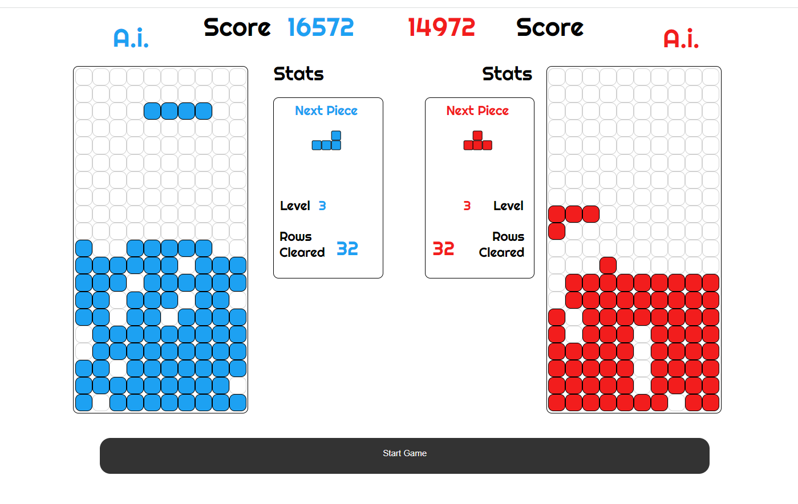

# Tetris Genetic Algorithm

### Introduction

The genetic algorithm is an unsupervised machine learning technique that learns strategy within games through a process similar to how genes are transferred through concepts such as natural selection. This project aims to implement a variation of the genetic algorithm to produce nodes that learn to play the game of Tetris.

**Gallery**



### Usage

**Interactive Web Application**

For demonstration purposes, this project has been deployed on Heroku servers. The Tetris game along with the genetic algorithm implementation runs using the Front-End Javascript library React. The web application is set to have two different A.I. nodes competing against each other in real-time. Player input can be taken in using the ```‘a, w, s, d’``` keys as well as the ```‘left, up, down, right’``` arrow keys. These inputs interfere with the A.I. and cause it to adopt a new strategy for playing the game.

**Please allow roughly 30 seconds for the server to boot up when clicking the link below**

The application can be interacted with [Here](https://tetris-genetic-algorithm.herokuapp.com/)

**Game States**

Three different game states can be manually adjusted in the code. The states can be either A.I. off where the player has full control of all movements, A.I. on where the saved A.I. brain is used to make movements, or A.I. training on where the A.I. system generates nodes and begins the training process.

# Overview of Tetris Genetic Algorithm and its Implementation

### Matrices

**Tetris Shaps**

Each Tetris shape is defined as a 2D matrix. The shapes implemented in this game are as follows:

**Shape I**

```
[[0,0,0,0], 
 [1,1,1,1], 
 [0,0,0,0],
 [0,0,0,0]]
```

**Shape J**

```
[[2,0,0], 
 [2,2,2], 
 [0,0,0]]
```

**Shape L**

```
[[0,0,3], 
 [3,3,3], 
 [0,0,0]]
```

**Shape O**

```
[[4,4], 
 [4,4]]
```

**Shape S**

```
[[0,5,5], 
 [5,5,0], 
 [0,0,0]]
```

**Shape T**

```
[[0,6,0], 
 [6,6,6], 
 [0,0,0]]
```

**Shape Z**

```
[[7,7,0], 
 [0,7,7], 
 [0,0,0]]
```

Each shape matrix contains boolean values representing a position to be a filled-in block piece or an empty space. The arrangement of different values allows for the creation of different shapes to be represented. Matrix sizes for each shape are dependent on the rotation position possibilities of each shape.

**Game Grid**

The game grid is defined as a 10 column by 20 row matrix. On initiation, the grid is filled with zeros. As Tetris shapes are applied to the grid the matrix is populated with Tetris shape values.

```
[[0, 0, 0, 0, 0, 0, 0, 0, 0, 0],
 [0, 0, 0, 0, 0, 0, 0, 0, 0, 0],
 [0, 0, 0, 0, 0, 0, 0, 0, 0, 0],
 [0, 0, 0, 0, 0, 0, 0, 0, 0, 0],
 [0, 0, 0, 0, 0, 0, 0, 0, 0, 0],
 [0, 0, 0, 0, 0, 0, 0, 0, 0, 0],
 [0, 0, 0, 0, 0, 0, 0, 0, 0, 0],
 [0, 0, 0, 0, 0, 0, 0, 0, 0, 0],
 [0, 0, 0, 0, 0, 0, 0, 0, 0, 0],
 [0, 0, 0, 0, 0, 0, 0, 0, 0, 0],
 [0, 0, 0, 0, 0, 0, 0, 0, 0, 0],
 [0, 0, 0, 0, 0, 0, 0, 0, 0, 0],
 [0, 0, 0, 0, 0, 0, 0, 0, 0, 0],
 [0, 0, 0, 0, 0, 0, 0, 0, 0, 0],
 [0, 0, 0, 0, 0, 0, 0, 0, 0, 0],
 [0, 0, 0, 0, 0, 0, 0, 0, 0, 0],
 [0, 0, 0, 0, 0, 0, 0, 0, 0, 0],
 [0, 0, 0, 0, 0, 0, 0, 0, 0, 0],
 [0, 0, 0, 0, 0, 0, 0, 0, 0, 0],
 [0, 0, 0, 0, 0, 0, 0, 0, 0, 0]]
```

**Piece Movement**

The process for piece moving is the same for both player inputs and A.I. inputs. In the case of player input, a value is triggered by the press of keys from the player. This value translates to what direction or rotation to move the piece during the current interval of the game loop. The A.I. generates a list of movements to move the Tetris piece, one movement is made from the movement list every interval of the game loop. Collisions are handled by comparing the location of the current Tetris piece in the game grid to the grid walls, floor, and other block components currently within the grid. When a collision is predicted, block movement in the input direction or rotation is restricted.

**Row Clearing and Scoring**

In this implementation of Tetris, the scoring is calculated based on how many rows are cleared in one game loop iteration. The more rows (up to four) that are cleared in one iteration the higher the score for that move. Row clearing is done by checking if a full row of filled-in blocks exists in the matrix. In the event that there is a full row, the row is removed and all above blocks are shifted downward.

**A.I. Metrics**

The metrics that are referenced by the A.I. during each interval of the game include the game grid's cumulative height, holes, relative height, and roughness. These metrics are values representing different observable characteristics of the current state of the game. Cumulative height returns a value representing the total combined height of all the columns in the grid. The holes metric returns a value of the total number of holes (a zero surrounded by ones) in the grid. Relative height returns the range value of the tallest column height subtracted by the shortest column height. The roughness metric returns the average difference in height from column to column in the grid.

**A.I. Brain**

The “Brain” of the A.I. system within the game consists of a javascript object of key-value pairs. The object contains eight pairs whose values are measurements of the current performance of the A.I. as well as scaler inputs to functions that reference metrics within the game grid. The performance measurements include a ranking value that is used to compare A.I. brains during training and a rows cleared count value that is used to influence the ranking measurement. The scaler key-value pairs are used during the game loop to manipulate how the A.I. makes its movements. There is a scaler value for each of the metrics calculated from the game grid. 

**A.I. Training**

A generation of different children nodes are initialized with random values in their “Brain” objects. These children nodes play Tetris and the nodes with the highest-ranking measurements are kept and the rest are discarded. The remaining nodes are then bred with each other creating new child nodes that contain values from either parent node. The new child nodes are then exposed to a mutation variable that slightly adjusts their values. The new generation of children nodes play Tetris, are ranked, and the process continues. For each generation, it is seen that the top-performing children nodes become increasingly strategic at playing the game.

**A.I. Moves**

The A.I. system is designed to interact with the game the same way that the player interacts with the game. This is achieved by having the A.I. system output a list of moves to be referenced by the game loop during each iteration. The moves list is generated by using the A.I. brain and grid metrics to calculate a new position for the current Tetris piece. Then a list is generated mapping out the inputs that need to be made to get from the previous Tetris block location to the new position.